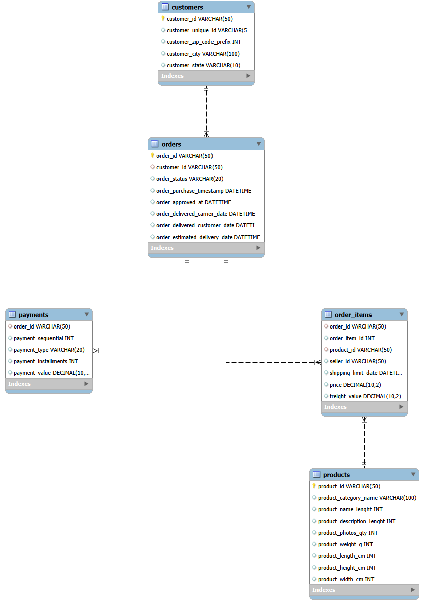

# E-commerce Sales Performance Dashboard

## Overview
This project analyzes e-commerce sales data to uncover trends, revenue drivers, and customer behavior using SQL, Python, and Power BI.

## Tools Used
- Python (Pandas, Matplotlib)
- MySQL
- Power BI

## Project Workflow
1. Cleaned raw Olist e-commerce data using Python.
2. Loaded cleaned data into MySQL with proper schema and relationships.
3. Performed SQL queries for business metrics.
4. Built an interactive Power BI dashboard.

## Key Insights
- Sales peak between May and August.
- Revenue drops sharply in September.
- Top 10 product categories contribute the majority of revenue.
- Average Order Value remains stable across months.

## Dashboard Features
- KPIs: Total Orders, Revenue, AOV
- Monthly sales trends
- Order status distribution
- Top product categories by revenue

## Dataset
This project uses the Olist Brazilian E-commerce dataset.
Due to GitHub file size limits, raw and cleaned CSV files are not included.
Data can be accessed from:
https://www.kaggle.com/datasets/olistbr/brazilian-ecommerce

## 🗂 Database Schema (ER Diagram)

