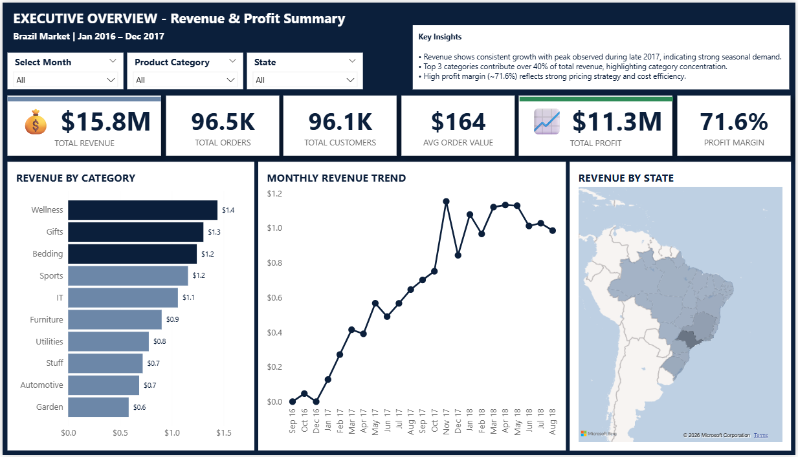
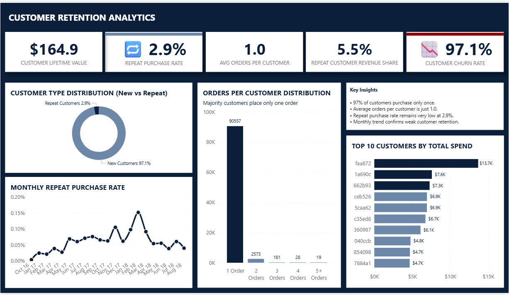
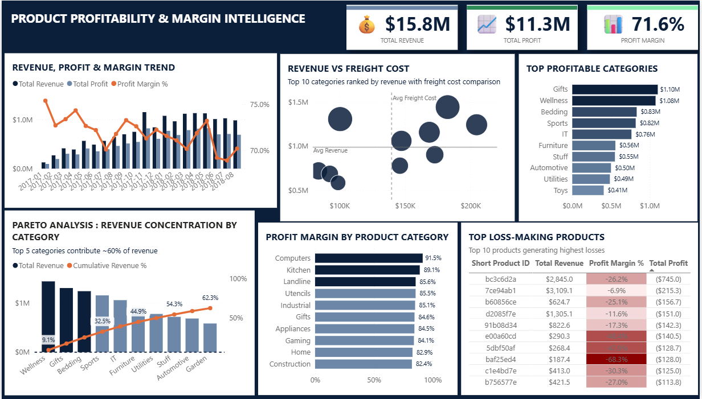
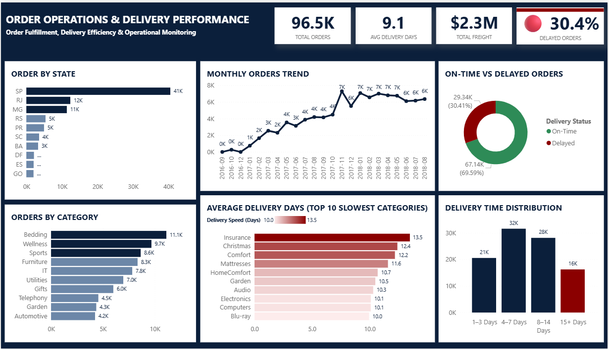
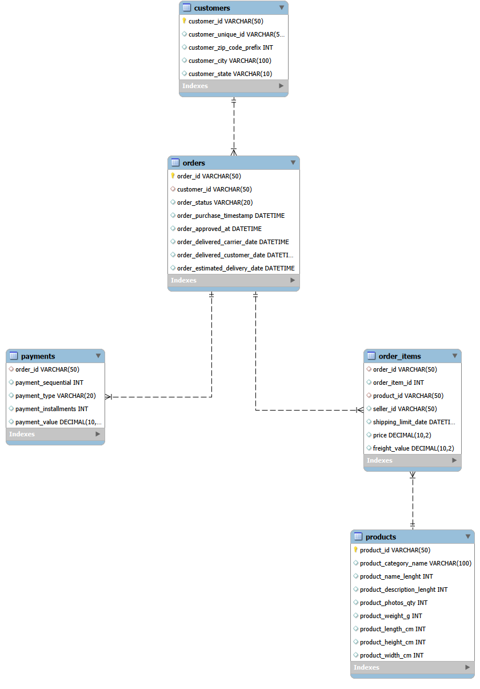

# 🛒 E-Commerce Business Intelligence & Customer Analytics Platform

🚀 **End-to-End Data Analytics Project | SQL + Python + Power BI**

---

## 📌 Overview

This project demonstrates a complete **Business Intelligence (BI) pipeline** built on a real-world e-commerce dataset.

It transforms raw transactional data into **actionable insights** to analyze:

* 📈 Sales performance
* 👥 Customer behavior
* 💰 Profitability
* 🔁 Retention patterns

---

## 🎯 Project Objective

Enable **data-driven decision-making** by converting raw data into meaningful business insights using modern analytics tools.

---

## ❗ Problem Statement

E-commerce businesses often struggle with:

* Identifying **top revenue-driving products & categories**
* Understanding **customer retention & repeat behavior**
* Measuring **true profitability after logistics costs**
* Analyzing **seasonal trends & growth patterns**

---

## 💡 Solution Approach

Built a complete analytics solution:

* 🧹 Cleaned & transformed raw data using **Python (Pandas)**
* 🗄 Designed a **normalized MySQL database schema**
* 📊 Created **analytical SQL views & KPI queries**
* 📈 Developed an **interactive Power BI dashboard**

---

## 🛠 Tech Stack

* **Python** → Pandas, NumPy
* **SQL (MySQL)** → Joins, CTEs, Window Functions
* **Power BI** → DAX, Data Modeling, Dashboarding
* **Git & GitHub** → Version Control

---

## 🔄 Data Pipeline

Raw CSV Data
⬇
Data Cleaning & Transformation (Python)
⬇
Relational Database (MySQL)
⬇
SQL Analytics & KPIs
⬇
Power BI Dashboard

---

## 📊 Dashboard Preview

### 📌 Executive Overview



### 👥 Customer Retention



### 📦 Product Profitability



### 🚚 Delivery Performance



---

## 🗄 Database Design

Normalized schema with:

* Customers
* Orders
* Order Items
* Payments
* Products

### 🔧 Implemented Concepts:

* Primary & Foreign Keys
* Indexing
* Analytical Views

---

## 📈 Key Metrics

* Total Revenue
* Total Orders
* Average Order Value (AOV)
* Profit & Margin
* Repeat Purchase Rate
* Customer Churn

---

## 🔍 Key Insights

* 📈 Revenue shows steady growth with seasonal peaks
* 🏆 Top categories contribute majority of revenue (**Pareto principle**)
* ⚠ Customer retention is low (~3%) → improvement needed
* 🚚 High logistics cost reduces profitability
* 📉 Demand drops after peak seasons

---

## 🧠 Business Recommendations

* 🎯 Improve retention through loyalty programs
* 📦 Focus on high-performing categories
* 🚚 Optimize logistics & delivery costs
* 🎉 Run targeted seasonal campaigns

---

## 📊 Advanced Analysis

* Cohort Analysis (Customer Retention)
* RFM Analysis (Customer Segmentation)
* Revenue Growth (Month-over-Month)
* Profit vs Freight Analysis

---

## 💻 SQL Highlights

* Window Functions (LAG, RANK)
* Common Table Expressions (CTEs)
* Aggregations & KPI calculations
* Case-based segmentation

---

## 📊 DAX Measures

```DAX
Total Revenue = SUM(payments[payment_value])
Total Orders = DISTINCTCOUNT(orders[order_id])
AOV = DIVIDE([Total Revenue], [Total Orders])
```

---

## 🧩 Data Model (ER Diagram)



---

## ⚙️ Setup Instructions

### 1️⃣ Clone Repository

```bash
git clone https://github.com/your-username/ecommerce-bi-project.git
cd ecommerce-bi-project
```

### 2️⃣ Install Dependencies

```bash
pip install -r requirements.txt
```

### 3️⃣ Configure Environment

Create `.env` file:

```env
DB_HOST=localhost
DB_PORT=3306
DB_USER=root
DB_PASS=root
DB_NAME=ecommerce_bi
```

### 4️⃣ Load Data

```bash
python load_data_to_mysql.py
```

### 5️⃣ Run SQL Scripts

Execute:

```
sql/ecommerce_schema.sql
```

### 6️⃣ Open Dashboard

Open `.pbix` file in Power BI

---

## 📂 Dataset

Dataset: **Olist Brazilian E-Commerce Dataset**
https://www.kaggle.com/datasets/olistbr/brazilian-ecommerce

---

## 🎯 Key Outcome

This project demonstrates the ability to:

* Build an **end-to-end BI solution**
* Perform **data cleaning, SQL analytics, and visualization**
* Generate **real business insights**
* Use **industry-standard tools** effectively

---

## ⭐ Support

If you found this project helpful, consider giving it a ⭐ on GitHub!

---

## 🔗 Connect With Me

Feel free to connect on LinkedIn for opportunities, feedback, or collaboration.